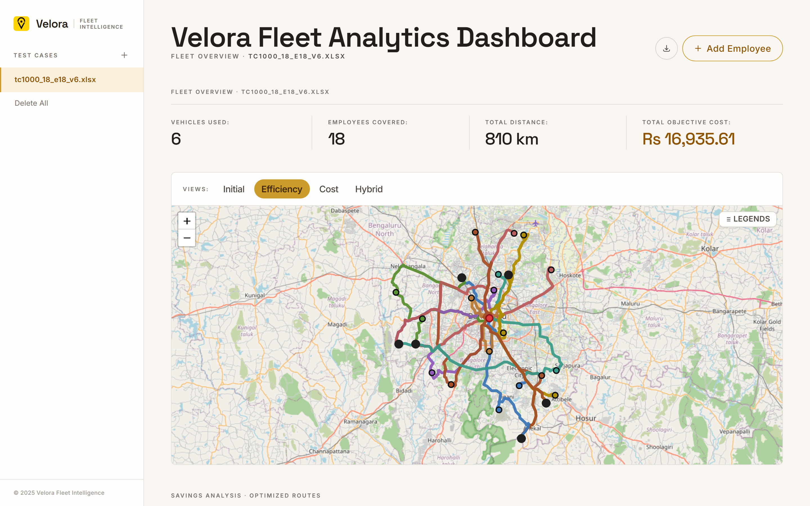
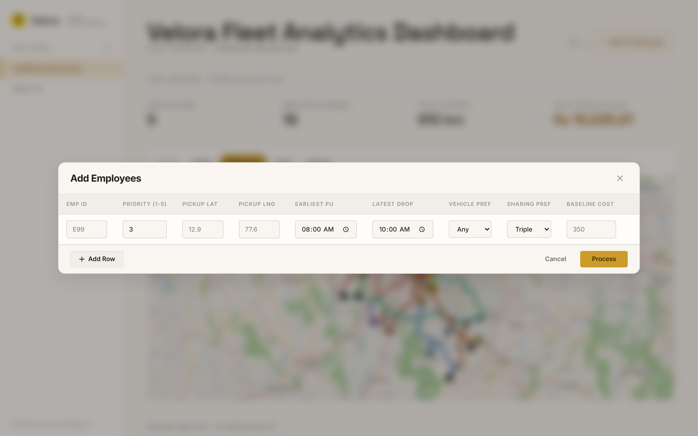

# Opti26 / Velora — Corporate Mobility Route Optimization Platform

> **A full-stack corporate mobility and employee cab-pooling optimization platform that solves the Vehicle Routing Problem with Time Windows (VRPTW) using native C++ metaheuristics (ALNS) and a dual-layer hard/soft constraint validation engine.**

[](https://opti26-velora.vercel.app/)
[](https://api.velora-opti26.xyz)
[](./Opti26_mobile/velora.apk)

---

## 🖼️ Application Showcase

### 1. Dataset Upload & Welcome Interface (Empty State)

*Initial application landing state on local environment allowing corporate transport managers to upload Excel dataset workbooks or configure optimization parameters.*

---

### 2. Live Route Optimization & Fleet Analytics Dashboard

*Live interactive Leaflet route map showing optimized cab pooling routes across Bengaluru, fleet utilization metrics, baseline cost comparisons, and OSRM road geometry.*

---

### 3. Real-Time Dynamic Employee Insertion Modal

*Interactive modal interface to dynamically insert new employee pickup points into active fleet route calculations without full recalculations.*

---

## ⚡ Key Engineering & Algorithmic Highlights

- **Metaheuristic Optimization Solver (ALNS)**: Drives route calculation using precompiled native C++ executables (`velora_*`) implementing Adaptive Large Neighborhood Search for high-throughput route generation.
- **$O(1)$ Dynamic Route Insertion**: Supports real-time insertion of new employees into pre-computed trip solutions without triggering expensive $O(N!)$ global re-optimizations.
- **Dual-Layer Constraint Validation**:
  - **Hard Constraints (H1–H6)**: Mandatory checks for pickup/drop time windows, vehicle capacity, single employee assignment, and existence validation.
  - **Soft Constraints (S1–S4)**: Preference tracking for vehicle categories (premium/normal), maximum sharing limits, priority delay budgets, and cost vs. baseline thresholds.
- **Multi-Mode Benchmarking**: Concurrent execution and UI comparison across three solver modes: `Optimized` (primary), `No Constraints` (upper-bound reference), and `Infeasible Handling` (graceful fallback).
- **Fault-Tolerant Road Geometry**: Multi-tiered OSRM lookup engine with automatic fallback handling (Full Route $\rightarrow$ Segment Stitching $\rightarrow$ Straight Line Polyline) to ensure 100% map availability.

---

## 📐 System Architecture & Data Flow

```
 Excel (.xlsx)                     Native C++ optimizers                JSON result
┌────────────┐   parse   ┌──────────────────────────────────┐   read   ┌──────────┐
│ employees  │──────────▶│ velora_final            (default) │─────────▶│ vehicles │
│ vehicles   │  to JSON  │ velora_noconstraints    (upper)   │          │ trips    │
│ baseline   │           │ velora_infeasiblehandling (relaxed)│          │ summary  │
└────────────┘           └──────────────────────────────────┘          └────┬─────┘
      ▲                                                                       │
      │                             evaluator.py  (H1–H6 hard, S1–S4 soft)   │
   React web / Android  ◀───────────  Django REST API  ◀──────────────────────┘
```

---

## 🧩 Tech Stack

| Component | Stack | Location |
|-----------|-------|----------|
| **Backend** | Python 3.12, Django 6.0, Gunicorn | `Opti26_Backend/`, `optimizer/` |
| **Optimization Engine** | Native C++ Binaries, Python Evaluator | `optimizer/executables/` |
| **Database** | SQLite3 | `db.sqlite3` |
| **Web Frontend** | React 18, Vite 5, Tailwind CSS 4, Leaflet.js | `frontend/` |
| **Mobile App** | Capacitor 8 (Android WebView Wrapper) | `Opti26_mobile/` |
| **Deployment** | Docker (Railway), Vercel, Gradle APK | `Dockerfile`, `frontend/`, `Opti26_mobile/android/` |

---

## 🚀 Quick Start (Local Development)

### 1. Backend Setup
```bash
# Navigate to project root
cd Opti26_web

# Create and activate virtual environment
python -m venv venv
# On Windows:
.\venv\Scripts\activate
# On macOS/Linux:
source venv/bin/activate

# Install dependencies and start server
pip install -r requirements.txt
python manage.py migrate
python manage.py runserver
```

### 2. Frontend Setup
```bash
# Navigate to frontend directory
cd frontend

# Install node packages and start Vite dev server
npm install
npm run dev
```

The web application will be accessible at `http://localhost:5173/`.

---

## 📖 Detailed Documentation Index

Read the comprehensive technical guides inside the [`docs/`](./docs) folder:

| # | Document | What it covers |
|---|----------|----------------|
| 1 | [PROJECT_OVERVIEW.md](./docs/PROJECT_OVERVIEW.md) | Business problem, core product features, sub-applications, and non-goals. |
| 2 | [ARCHITECTURE.md](./docs/ARCHITECTURE.md) | System design, request/response lifecycle, data flow diagrams, and OSRM integration. |
| 3 | [APP_STRUCTURE.md](./docs/APP_STRUCTURE.md) | Complete directory tree with file-by-file explanations. |
| 4 | [QUICK_START.md](./docs/QUICK_START.md) | Fastest steps to run the backend, web frontend, and mobile wrapper locally. |
| 5 | [INSTALLATION.md](./docs/INSTALLATION.md) | Platform-by-platform setup guide (Windows, macOS, Linux, Docker). |
| 6 | [ENVIRONMENT_SETUP.md](./docs/ENVIRONMENT_SETUP.md) | Environment variables, CORS settings, executable paths, and tool versions. |
| 7 | [API_REFERENCE.md](./docs/API_REFERENCE.md) | Complete HTTP endpoint documentation (methods, payloads, headers, error formats). |
| 8 | [MODELS_DOCUMENTATION.md](./docs/MODELS_DOCUMENTATION.md) | Django models, schema definitions, and migration strategies. |
| 9 | [DATA_FORMATS.md](./docs/DATA_FORMATS.md) | Excel workbook layout specification and optimization output JSON schema. |
| 10 | [OPTIMIZATION_ENGINE.md](./docs/OPTIMIZATION_ENGINE.md) | C++ binary I/O contract, ALNS configuration, dynamic insertion algorithm, and evaluator rules. |
| 11 | [FRONTEND_DOCUMENTATION.md](./docs/FRONTEND_DOCUMENTATION.md) | React UI components, Leaflet map geometry, state management, and PDF report generator. |
| 12 | [MOBILE_DOCUMENTATION.md](./docs/MOBILE_DOCUMENTATION.md) | Capacitor 8 Android wrapper setup and APK release process. |
| 13 | [DEPLOYMENT.md](./docs/DEPLOYMENT.md) | Production Docker build, Railway deployment, Vercel frontend, and release management. |
| 14 | [IMPLEMENTATION_SUMMARY.md](./docs/IMPLEMENTATION_SUMMARY.md) | Technical architectural decisions, design patterns, and engineering tradeoffs. |

---

## 🛠️ Key Developer References

- **Backend Orchestration**: [`optimizer/views.py`](./optimizer/views.py)
- **Constraint Validation Engine**: [`optimizer/executables/evaluator.py`](./optimizer/executables/evaluator.py)
- **Frontend Core Application**: [`frontend/src/App.jsx`](./frontend/src/App.jsx)
